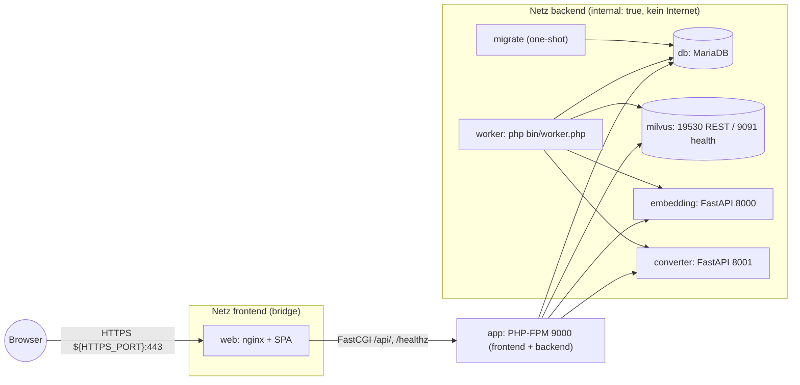
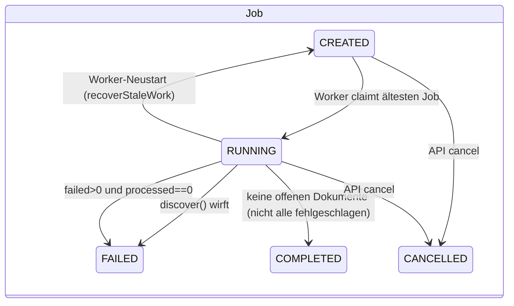
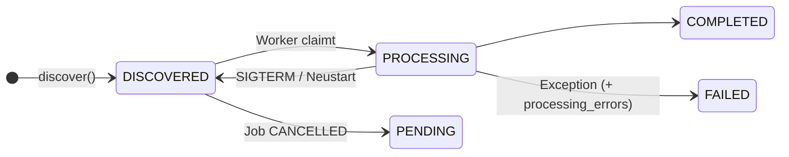
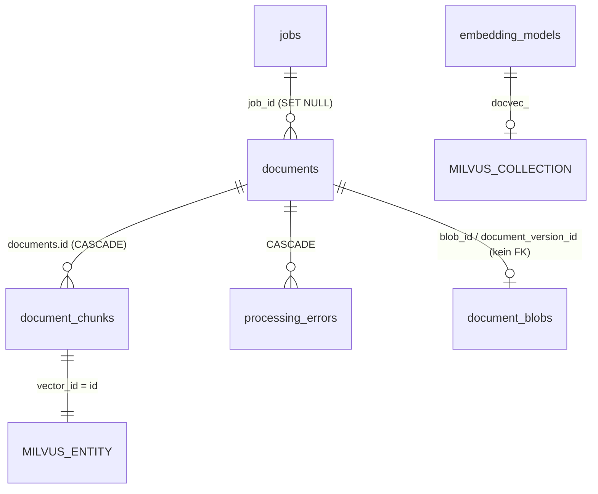

# Agent's Index – DocVecWizard

> Wissensbasis für Coding-Agenten. Erstellt durch Analyse des Quellcodes (Stand: Branch nach PR #4, Security-Audit-Refactor).
> Kennzeichnung: **[Fakt]** = direkt im Code/Config belegt · **[Abgeleitet]** = aus mehreren Stellen geschlossen · **[Annahme]** = nicht verifiziert.
> Ohne Kennzeichnung gilt: Fakt, mit Datei-Referenz.
> Bei Widerspruch zwischen `docs/*.md` und Code gilt **der Code**. Bekannte Abweichungen: siehe [Open Questions](#open-questions) und [Technical Debt](#technical-debt).

## Inhaltsverzeichnis

1. [Project Overview](#project-overview)
2. [Repository Structure](#repository-structure)
3. [Technology Stack](#technology-stack)
4. [Architecture](#architecture)
5. [Core Components](#core-components)
6. [Entry Points](#entry-points)
7. [Data Model](#data-model)
8. [Data Flows](#data-flows)
9. [Business Logic](#business-logic)
10. [APIs and Integrations](#apis-and-integrations)
11. [Configuration](#configuration)
12. [Authentication and Authorization](#authentication-and-authorization)
13. [Error Handling](#error-handling)
14. [Logging and Observability](#logging-and-observability)
15. [Testing](#testing)
16. [Build and Development](#build-and-development)
17. [CI/CD](#cicd)
18. [Important Invariants](#important-invariants)
19. [Danger Zones](#danger-zones)
20. [Change Map](#change-map)
21. [Where to Look First](#where-to-look-first)
22. [Technical Debt](#technical-debt)
23. [Architectural Decisions](#architectural-decisions)
24. [Historical Context](#historical-context)
25. [Open Questions](#open-questions)
26. [Agent Operating Guidelines](#agent-operating-guidelines)

---

## Project Overview

**DocVecWizard** („Document Embedding Manager“) ist ein selbst gehosteter Docker-Compose-Stack, der Dokumente (PDF, Office, Text, …) aus einem Eingangsverzeichnis einliest, in Text konvertiert, in Chunks zerlegt, mit lokalen Qwen3-Embedding-Modellen vektorisiert und in **Milvus** speichert. Metadaten, Originaldateien (Base64), Chunks, Jobs, Benutzer und Audit-Log liegen in **MariaDB**. Eine Single-Page-Web-UI (deutsch) erlaubt Upload, Jobsteuerung, semantische Suche, Export/Import, Integritätsprüfung und TLS-Verwaltung.

- Zielgruppe [Abgeleitet]: Betreiber eines internen/offline RAG-Vorverarbeitungs-Servers, ein einziger Admin-Benutzertyp (keine Rollen).
- Betriebsmodell: vollständig lokal; nur Container `web` veröffentlicht einen Port (`${HTTPS_PORT}:443`) ([docker-compose.yml](docker-compose.yml)).
- Sprache: UI-Texte, Fehlermeldungen an Nutzer und `docs/` sind **deutsch**; Code und Code-Kommentare englisch.
- Ursprung: Generiert aus den Spezifikations-Prompts [.agent/job.md](.agent/job.md) (Hauptspezifikation) und [.agent/ext1.md](.agent/ext1.md) (Erweiterung: Base64-Originale, Versionierung, Export-Roundtrip).

## Repository Structure

```
/
├── docker-compose.yml        # Gesamter Stack (8 Services), Netzwerke, Volumes
├── .env.example              # Alle Umgebungsvariablen mit Defaults (keine echten Secrets)
├── .gitattributes            # Erzwingt LF (CRLF hatte Entrypoints gebrochen)
├── app/                      # PHP-Backend (FPM) – API, Worker, Migrationen
│   ├── Dockerfile            # php:8.3-fpm-alpine, User app (10003)
│   ├── docker-entrypoint.sh  # schreibt PHP-ini (Upload-Limits), Verzeichnisse, su-exec
│   ├── php-fpm.d/www.conf    # FPM-Pool (clear_env = no!)
│   ├── bin/                  # CLI: worker.php, migrate.php, set-password.php, healthcheck.php
│   ├── config/bootstrap.php  # Autoloader, Error-Handler, Config + DB-Init
│   ├── public/index.php      # Einziger HTTP-Einstiegspunkt (Front Controller)
│   ├── migrations/*.sql      # AUSGEFÜHRTE Migrationen (0001–0003)
│   └── src/
│       ├── Core/             # Config, Db, Logger(Instance), Uuid, Base64
│       ├── Domain/           # JobStatus (Enum)
│       ├── Http/             # Request, Response, Router, HttpException, JsonClient, UpstreamException, UploadedFile
│       ├── Controllers/      # Routes.php (Routentabelle) + Controller je Bereich
│       ├── Security/         # AccessGuard, Auth, Session, Csrf, LoginThrottle, PathGuard
│       └── Services/         # Geschäftslogik + Clients (Milvus, Embedding, Converter), Audit, Chunker
├── database/                 # NUR Referenz: schema.sql (konsolidiert) + Kopie der Migrationen
├── converter/                # Python/FastAPI: Datei → Text (pandoc, pdftotext, LibreOffice)
├── embedding/                # Python/FastAPI: Text → Vektor (torch/transformers, CPU)
│   ├── catalog.json          # Modellkatalog (Qwen3-Embedding 0.6B/4B/8B)
│   ├── scripts/download-models.py
│   └── models/               # Bind-Mount /models (Modelle, gitignored)
├── web/                      # nginx 1.27 + statische SPA
│   ├── nginx.conf, security-headers.conf, docker-entrypoint.sh (Self-signed-Fallback, Cert-Reload)
│   └── html/                 # index.html, assets/js/app.js (~1190 Zeilen), assets/css/app.css
├── scripts/                  # backup-db.sh, backup-milvus.sh, check-health.sh, status.sh
├── tests/                    # unit/ (lokal), integration/ (im Container), smoke-test.sh, fixtures/
├── docs/                     # Betriebs-/Architektur-Doku (deutsch), AUDIT_REPORT.md, manual.pdf
└── .agent/                   # Ursprüngliche Generierungs-Prompts (job.md, ext1.md)
```

Laufzeitdaten (gitignored, Bind-Mounts): `data/{input,staging,exports}` (`${DATA_DIR:-./data}`), `web/ssl/` (aktives Zertifikat, geteilt zwischen `app` (`/srv/ssl`) und `web` (`/etc/nginx/ssl`)), `embedding/models/`.

## Technology Stack

| Bereich | Technologie | Version / Quelle |
|---|---|---|
| Backend | PHP (FPM), **kein Framework, kein Composer** | `php:8.3-fpm-alpine` ([app/Dockerfile](app/Dockerfile)) |
| PHP-Extensions | pdo_mysql, mbstring, fileinfo, zip, pcntl, posix, curl | app/Dockerfile |
| Autoload | eigener PSR-4-artiger Autoloader `App\` → `app/src/` | [app/config/bootstrap.php](app/config/bootstrap.php) |
| Relationale DB | MariaDB (utf8mb4, `max-allowed-packet=256M`) | `mariadb:11.4` |
| Vektor-DB | Milvus standalone (embedded etcd, lokaler Storage), REST v2 | `milvusdb/milvus:v2.5.27` |
| Embedding | Python 3.11, FastAPI 0.115.6, uvicorn 0.34.0, torch 2.4.1 (CPU), transformers 4.51.3, numpy 1.26.4, huggingface_hub 0.30.2 | [embedding/Dockerfile](embedding/Dockerfile), [embedding/requirements.txt](embedding/requirements.txt) |
| Converter | Debian bookworm, pandoc, poppler-utils (pdftotext), LibreOffice (writer/calc/impress), tini, FastAPI/uvicorn | [converter/Dockerfile](converter/Dockerfile) |
| Webserver | nginx + openssl/curl | `nginx:1.27-alpine` ([web/Dockerfile](web/Dockerfile)) |
| Frontend | Vanilla JS SPA (Hash-Routing), keine Build-Toolchain, strikte CSP | [web/html/assets/js/app.js](web/html/assets/js/app.js) |
| Orchestrierung | Docker Compose (Projektname `docvecwizard`) | docker-compose.yml |
| Tests | eigener Mini-Testrunner (PHP), Bash-Smoke-Test | [tests/](tests/) |
| Linter/Formatter/Static Analysis | **keine konfiguriert** | – |

## Architecture

### Container und Netzwerke



- `app` hängt an `frontend` **und** `backend`; `worker`, `db`, `milvus`, `embedding`, `converter`, `migrate` nur an `backend` [Fakt, docker-compose.yml].
- Startreihenfolge: `db` healthy → `migrate` completed → `app` (und `worker`, zusätzlich `embedding` healthy) → `web` (wartet auf `app` healthy).
- `app` und `worker` nutzen **dasselbe Image** (`./app`), `worker` startet `php bin/worker.php`; `stop_grace_period: 60s`.
- Geteilte Bind-Mounts: `${DATA_DIR}/input|staging|exports` → `/srv/data/...` (app/worker rw; converter: `input` **ro**, `staging` rw, kein `exports`), `./web/ssl` → app `/srv/ssl`, web `/etc/nginx/ssl` (worker hat keinen TLS-Mount).

### Schichten im PHP-Backend

```
public/index.php ─► config/bootstrap.php (Config, Db, Logger, Error-Handler)
      │
      ▼
Http\Router ──(vor jedem Handler)──► Security\AccessGuard (Session, Auth, CSRF)
      │
      ▼
Controllers\* (dünn: Parameter lesen, Service aufrufen, Response::json)
      │
      ▼
Services\* (Geschäftslogik, PDO direkt via Core\Db, HTTP-Clients zu Milvus/Embedding/Converter)
```

- Keine DI-Container: Services werden in Controllern/Worker per `new` erzeugt; DB-Zugriff über statisches `Core\Db::pdo()` [Fakt].
- Kein ORM: rohes PDO mit Prepared Statements.
- Globaler statischer Zustand: `Config` (aus `getenv()`), `Db`, `Logger`, `Auth::$user`-Cache.

### Request-Pipeline (HTTP)

```mermaid
sequenceDiagram
  participant B as Browser (app.js)
  participant N as nginx
  participant I as index.php
  participant R as Router
  participant G as AccessGuard
  participant C as Controller/Service
  B->>N: /api/... (Cookie docvec_sid, X-CSRF-Token)
  N->>I: FastCGI (limit_req 20r/s burst 100, read_timeout 600s)
  I->>I: bootstrap (Config, Db UTC, Errorhandler)
  I->>R: dispatch(Request)
  R->>G: guard(route, request)
  G-->>R: 401/403 (HttpException) oder ok; Session::release()
  R->>C: handler(params)
  C-->>I: Response (JSON)
  I-->>B: JSON / Fehler-Mapping
```

### Worker-Zustandsmaschine





`PAUSED` (Job) existiert als Enum/UI-Label, wird aber **nirgends gesetzt** [Fakt].

## Core Components

| Komponente | Datei(en) | Verantwortung |
|---|---|---|
| Front Controller | [app/public/index.php](app/public/index.php) | Bootstrap, Router-Aufbau, Exception→HTTP-Mapping |
| Bootstrap | [app/config/bootstrap.php](app/config/bootstrap.php) | Autoloader, Error→Exception, `Config::load(getenv())`, `Db::connect` (`SET time_zone='+00:00'`), Zeitzone |
| Config | [app/src/Core/Config.php](app/src/Core/Config.php) | Typisierte Env-Zugriffe (`Config::string/int/…`), `secret()` (≥32 Zeichen, nicht `change-me…`) |
| Router | [app/src/Http/Router.php](app/src/Http/Router.php) | `{param}`→`[^/]+`, HEAD→GET, 405 mit `Allow`, Guard vor Handler, 400 bei kaputtem JSON |
| Routentabelle | [app/src/Controllers/Routes.php](app/src/Controllers/Routes.php) | **Alle** API-Routen, `public: true` markiert öffentliche |
| Security | [app/src/Security/](app/src/Security/) | AccessGuard, Auth (Argon2id), Session, Csrf, LoginThrottle, PathGuard |
| ProcessingService | [app/src/Services/ProcessingService.php](app/src/Services/ProcessingService.php) | Discovery, Dedupe/Versionierung, Blob-Speicherung, Convert→Chunk→Embed→Milvus |
| Chunker | [app/src/Services/Chunker.php](app/src/Services/Chunker.php) | Reine Funktion: Text → Chunks (Token-Schätzung, Overlap) |
| MilvusClient | [app/src/Services/MilvusClient.php](app/src/Services/MilvusClient.php) | REST v2, Collection-Schema, Insert/Delete/Search/Query, Retry bei Rate-Limit |
| EmbeddingClient / ConverterClient | [app/src/Services/EmbeddingClient.php](app/src/Services/EmbeddingClient.php), [app/src/Services/ConverterClient.php](app/src/Services/ConverterClient.php) | HTTP-Clients über [JsonClient](app/src/Http/JsonClient.php) |
| JobService | [app/src/Services/JobService.php](app/src/Services/JobService.php) | Job anlegen/listen/abbrechen, Zähler |
| DocumentService | [app/src/Services/DocumentService.php](app/src/Services/DocumentService.php) | Dokumente/Versionen/Chunks/Vektoren lesen, löschen, Download |
| SearchService | [app/src/Services/SearchService.php](app/src/Services/SearchService.php) | Semantische Suche (Query-Embedding + Milvus + MySQL-Hydration) |
| ExportService | [app/src/Services/ExportService.php](app/src/Services/ExportService.php) | tar.gz-Export/-Import inkl. Prüfsummen (≈740 Zeilen) |
| IntegrityService | [app/src/Services/IntegrityService.php](app/src/Services/IntegrityService.php) | Read-only Konsistenzprüfung MySQL ↔ Blobs ↔ Milvus |
| TlsService | [app/src/Services/TlsService.php](app/src/Services/TlsService.php) | Self-signed/CSR/Import/Aktivierung, Keys AES-256-GCM verschlüsselt |
| ModelService | [app/src/Services/ModelService.php](app/src/Services/ModelService.php) | Modellkatalog-Sync, Aktivierung |
| UploadService | [app/src/Services/UploadService.php](app/src/Services/UploadService.php) | Multipart-Upload nach `INPUT_ROOT` |
| UserService | [app/src/Services/UserService.php](app/src/Services/UserService.php) | Initial-Admin, Passwortrichtlinie, Passwortwechsel |
| Worker | [app/bin/worker.php](app/bin/worker.php) | Job-/Dokument-Schleife, Locks, Recovery, Finalisierung |
| Embedding-Service | [embedding/src/main.py](embedding/src/main.py) | Modell laden, `/embed`, `/embed/batch`, `/model`, `/model/active` |
| Converter-Service | [converter/src/main.py](converter/src/main.py) | `/convert` (Pfad-Allowlist), Formatweiche |
| SPA | [web/html/assets/js/app.js](web/html/assets/js/app.js) | `api()`-Wrapper (CSRF), Views per Hash-Route |

## Entry Points

| Einstieg | Datei | Ausgelöst durch | Hinweise |
|---|---|---|---|
| HTTP-API | [app/public/index.php](app/public/index.php) | nginx `location ^~ /api/` und `= /healthz` (FastCGI → `app:9000`) | Einziger Web-Einstieg; statische Dateien liefert nginx direkt |
| Worker | [app/bin/worker.php](app/bin/worker.php) | Container `worker` (Endlosschleife) | Advisory Lock `docvecwizard_worker`; weitere Instanzen warten (Standby) |
| Migrationen | [app/bin/migrate.php](app/bin/migrate.php) | Container `migrate` (one-shot) | Lock `docvec_migrate`; legt Initial-Admin an |
| Passwort setzen | [app/bin/set-password.php](app/bin/set-password.php) | manuell: `docker compose exec app php bin/set-password.php <user>` | Passwort per STDIN oder `DOCVEC_NEW_PASSWORD` |
| Healthcheck | [app/bin/healthcheck.php](app/bin/healthcheck.php) | Docker-Healthcheck `app`/`worker` | |
| Container-Init PHP | [app/docker-entrypoint.sh](app/docker-entrypoint.sh) | Start `app`/`worker`/`migrate` | Schreibt `zz-docvecwizard.ini` (Upload-Limits), legt Verzeichnisse an, CLI via `su-exec app` |
| Container-Init Web | [web/docker-entrypoint.sh](web/docker-entrypoint.sh) | Start `web` | Self-signed-Fallback aus `APP_HOSTNAMES`; pollt `cert.pem`-mtime alle 10 s → `nginx -s reload` |
| Embedding-API | [embedding/src/main.py](embedding/src/main.py) | uvicorn im Container `embedding` | |
| Converter-API | [converter/src/main.py](converter/src/main.py) | uvicorn im Container `converter` (tini) | |
| Modell-Download | [embedding/scripts/download-models.py](embedding/scripts/download-models.py) | manuell | Siehe [Open Questions](#open-questions) |
| SPA | [web/html/index.html](web/html/index.html) + [app.js](web/html/assets/js/app.js) | Browser | Init am Dateiende von app.js (`/api/auth/me`, dann Router) |
| Betriebsskripte | [scripts/](scripts/) | manuell (Host) | Backup DB/Milvus, Health, Status |
| Tests | [tests/unit/run.php](tests/unit/run.php), [tests/integration/run.sh](tests/integration/run.sh), [tests/smoke-test.sh](tests/smoke-test.sh) | manuell | Kein CI |

## Data Model

Quelle der Wahrheit: **[app/migrations/](app/migrations/)** (ausgeführt von `migrate.php`). [database/schema.sql](database/schema.sql) ist ein konsolidierter Endstand nur zur Referenz; [database/migrations/](database/migrations/) sind byteidentische Kopien – **werden nicht ausgeführt** [Fakt].

| Migration | Inhalt |
|---|---|
| `0001_initial.sql` | settings, embedding_models, jobs, documents (damals `document_id UNIQUE`), document_chunks, processing_errors, system_metrics, audit_log, tls_certificates, exports |
| `0002_*.sql` | Versionierung: entfernt UNIQUE auf `documents.document_id`, neu `document_version_id` (unique), `version`, `is_current`, `blob_id`, `metadata`; Tabelle `document_blobs`; `document_chunks.vector_id` |
| `0003_*.sql` | `users`, `login_attempts` |

### Tabellen (Kernauszug)

| Tabelle | Schlüssel / Besonderheiten |
|---|---|
| `jobs` | `id` (BIGINT PK, intern) · `job_id` (UUID, API) · `name`, `source_directory`, `recursive`, `embedding_model`, `embedding_dimension` · `status` (CREATED/RUNNING/COMPLETED/FAILED/CANCELLED/PAUSED) · Zähler `documents_*`, `chunks_total`, `vectors_total`, `tokens_total`, `bytes_total`, `error_count` |
| `documents` | `id` (BIGINT PK, intern) · `document_id` (UUID, **logisches** Dokument über alle Versionen) · `document_version_id` (UUID, unique) · `version` · `is_current` · `job_id` (BIGINT FK → `jobs.id`, `ON DELETE SET NULL`) · `file_hash` (SHA-256, indiziert) · `source_path` (absoluter **Container**-Pfad) · `blob_id` (ohne FK) · `processing_status` · `embedding_model`/`embedding_dimension` · `metadata` (JSON) |
| `document_blobs` | `base64_data` LONGTEXT, unique `document_version_id`, `sha256` (des Originals) – **kein FK** zu documents |
| `document_chunks` | `document_id` = **`documents.id` (BIGINT)**, nicht die UUID! (FK `ON DELETE CASCADE`) · `chunk_id` (UUID, unique) · `vector_id` = Milvus-Primärschlüssel · `chunk_index`, `page_start`, `page_end`, `text_length`, `token_count`, `text` |
| `processing_errors` | `job_id`, `document_id` (beide FK CASCADE), `step`, `error_message` |
| `embedding_models` | `name` unique, `dimension`, `distance_metric`, `active` (genau ein aktives Modell erwartet) |
| `users` | `username` unique, `password_hash` (Argon2id/bcrypt) |
| `login_attempts` | Throttling-Fenster pro User/IP |
| `audit_log` | `action`, `entity_type`, `entity_id`, `details` JSON (inkl. `actor` bei HTTP-Requests) |
| `tls_certificates` | `kind`, `cert_pem`, `csr_pem`, `private_key_enc` (**verschlüsselt**, AES-256-GCM), `active` |
| `exports` | `export_id` (UUID), `filename`, `status`, `manifest` JSON, `checksum`, `file_size` |
| `schema_migrations` | angewandte Migrationsdateien |
| `settings`, `system_metrics` | existieren, werden aber von der Logik praktisch nicht genutzt (siehe Tech Debt) |

### ID-Semantik (häufige Fehlerquelle)

- v1 eines Dokuments: `document_id == document_version_id` [Fakt, ProcessingService].
- Neue Version: gleiche `document_id`, neue `document_version_id`, `version+1`, alte Version `is_current=0`.
- `document_chunks.document_id` → `documents.id` (numerisch); `documents.job_id` → `jobs.id` (numerisch, nicht `jobs.job_id`).
- Milvus-Entity (Schema in [MilvusClient](app/src/Services/MilvusClient.php)): `id` (VarChar(36) PK = `vector_id`), `document_id`, `document_version_id`, `chunk_id`, `job_id` (UUID), `source_path`, `filename`, `document_hash`, `embedding_model`, `embedding_dimension`, `chunk_index`, `page_start`, `page_end`, `vector` (FloatVector, `dim` = Modelldimension). **Kein Text** in Milvus – Text liegt nur in MySQL.
- Collection-Name: `docvec_<slug(modellname)>`, eine Collection pro Embedding-Modell, Metrik COSINE, Index AUTOINDEX.



## Data Flows

### 1. Ingest (Upload → Vektoren)

1. Upload (`POST /api/upload`, Felder `files[]` + `path`) → [UploadService](app/src/Services/UploadService.php) schreibt nach `INPUT_ROOT/<path>` (PathGuard, Namensvalidierung). **Erzeugt keinen Job.**
2. Job anlegen (`POST /api/jobs`, Body `name`, `source_directory`, `recursive`, `embedding_model`) → `jobs` mit `CREATED`.
3. Worker: claimt ältesten `CREATED`-Job → `RUNNING` → `ProcessingService::discover()`:
   - `PathGuard::resolve(INPUT_ROOT, source)`; rekursiver Scan, Symlinks übersprungen, nur unterstützte Endungen (18, `SUPPORTED_EXTENSIONS`).
   - Pro Datei SHA-256:
     - gleicher Pfad + gleicher Hash (aktuelle Version) → **überspringen** (unabhängig vom Status!)
     - gleicher Pfad + anderer Hash → **neue Version**
     - sonst Hash existiert **global** in irgendeinem Dokument → überspringen (Dedupe)
     - sonst neues Dokument v1
   - Original wird komplett in den Speicher gelesen, Base64-kodiert, in `document_blobs` gespeichert.
4. Worker: claimt ein `DISCOVERED`/`PENDING`-Dokument eines `RUNNING`-Jobs → `processDocument()`:
   - Converter `POST /convert {path}` → `text`, `page_count`.
   - Seitenaufteilung per `\f` **nur für `.pdf`**, sonst Seite = `max(1, page_count)`.
   - [Chunker](app/src/Services/Chunker.php) → Chunks.
   - Collection sicherstellen; Altlasten (Chunks/Vektoren derselben Version) löschen (Idempotenz).
   - Embedding in Batches (`EMBED_BATCH_SIZE`) über `POST /embed/batch` **ohne Modellnamen** → Embedding-Service nutzt sein aktuell geladenes Modell.
   - Chunks in MySQL speichern, dann Milvus-Insert (Retry bei Rate-Limit-Code 1807, exponentielles Backoff, 6 Versuche).
   - Status `COMPLETED` bzw. `FAILED` + `processing_errors`.
5. Worker: Job ohne offene Dokumente → Zähler aktualisieren, **einmal** Milvus-Flush pro Job (Flush ist rate-limitiert), Status setzen.

### 2. Suche

`POST /api/search` → [SearchService](app/src/Services/SearchService.php): aktives Modell aus `embedding_models` (Fallback: erstes) → Query-Embedding (max. 2000 Zeichen) → Milvus-Search (`limit` 1–50) → Texte aus `document_chunks` nachladen. **Kein Filter auf `is_current`** → Vektoren alter Versionen bleiben auffindbar.

### 3. Export / Import

- Export (`POST /api/exports`, synchron im HTTP-Request, `set_time_limit(0)`): tar.gz via `PharData` unter `EXPORT_ROOT`:
  `documents/<versionId>/{metadata.json, original.b64, checksum.sha256, chunks.json, vectors.json}`, `mysql/*.json`, `milvus/collections.json`, `config/embedding-models.json`, `manifest.json` (`FORMAT_VERSION = '1.0'`), `checksums/SHA256SUMS`; anschließende Verifikation; Zeile in `exports`.
- Import (`POST /api/import`, Multipart-Feld `archive`, `strategy` = `skip|overwrite`): `assertSafeArchive` (max. Einträge/Bytes, kein `..`), Prüfsummen, Import je Version **mit Erhalt der IDs**, `job_id = NULL`, Jobs/Modelle werden nicht importiert. Milvus-Fehler nach MySQL-Commit → Exception, Teilzustand bleibt. Zusätzlich Legacy-Pfad für JSON-Manifest-Import.

### 4. Löschen eines Dokuments

`DELETE /api/documents/{id}` → alle Versionen + Blobs in einer Transaktion (Chunks per CASCADE), danach **best effort** Milvus-Delete per `document_id`, Audit-Eintrag.

### 5. Login

`GET /api/csrf` (Token) → `POST /api/auth/login` (CSRF geprüft) → LoginThrottle → Argon2id-Verify (Dummy-Hash bei unbekanntem User) → Rehash falls nötig → `session_regenerate_id` → neues CSRF-Token in der Antwort.

### 6. TLS-Aktivierung

UI → `TlsService` (self-signed erzeugen / CSR / Zertifikat importieren) → `activate`: schreibt `key.pem` (0600) und danach atomar `cert.pem` nach `TLS_STORE` (`/srv/ssl` = `./web/ssl`) → `web`-Entrypoint erkennt mtime-Änderung (≤10 s) → nginx reload.

## Business Logic

### Dedupe und Versionierung (ProcessingService::discover)

- Identität einer Datei = **absoluter Container-Pfad** (`source_path`) + SHA-256.
- Unverändert (gleicher Pfad, gleicher Hash) → wird **immer übersprungen**, auch wenn die vorhandene Version `FAILED`/`PENDING` ist. → Es gibt **keinen Retry** für fehlgeschlagene Dokumente; Workaround [Abgeleitet]: Dokument per API löschen (entfernt alle Versionen) und Job erneut starten, oder Datei ändern.
- Globaler Dedupe: Inhalt existiert bereits unter anderem Pfad → übersprungen, **nicht** mit dem neuen Job verknüpft. Ein Job kann daher mit 0 Dokumenten `COMPLETED` enden.
- Neue Version: alte Version wird `is_current=0` gesetzt **außerhalb** der Insert-Transaktion (nicht atomar). Alte Chunks/Vektoren bleiben erhalten.

### Job-Status und Finalisierung ([app/bin/worker.php](app/bin/worker.php))

Schleife pro Iteration (sequenziell, ein Dokument gleichzeitig):
1. ältesten `CREATED`-Job → `RUNNING`, `discover()` (Exception → Job `FAILED`; bereits entdeckte Dokumente bleiben `DISCOVERED` und werden nie verarbeitet [Abgeleitet]).
2. ein `DISCOVERED`/`PENDING`-Dokument eines `RUNNING`-Jobs verarbeiten.
3. `RUNNING`-Job ohne offene Dokumente finalisieren: Zähler aktualisieren, ein Milvus-Flush, `FAILED` nur wenn `failed > 0 && processed == 0`, sonst `COMPLETED`.
4. Dokumente von `CANCELLED`-Jobs, die noch `DISCOVERED` sind → `PENDING` (bleiben dauerhaft liegen; kein Resume-API).
5. Leerlauf → `sleep(WORKER_POLL_INTERVAL)` (Default 2 s).

Start: Advisory Lock (Single Active Worker), Modellkatalog-Sync vom Embedding-Service, `recoverStaleWork` (`RUNNING`-Jobs → `CREATED`, `PROCESSING`-Dokumente → `DISCOVERED`). SIGTERM/SIGINT: laufendes Dokument → `DISCOVERED`, Lock freigeben.

### Chunking ([app/src/Services/Chunker.php](app/src/Services/Chunker.php))

Reine Funktion. Token-Schätzung ≈ `ceil(len/4)` pro Wort, CJK 1 Token/Zeichen. Absätze → Sätze → harte Splits; Overlap aus dem Ende des vorigen Chunks; harte Obergrenze `CHUNK_MAX_TOKENS`. Parameter: `CHUNK_SIZE_TOKENS` (512), `CHUNK_OVERLAP_TOKENS` (64), `CHUNK_MAX_TOKENS` (1024). `CHUNK_MIN_TOKENS` wird **nicht** verwendet.

### Modelle

- Katalog: [embedding/catalog.json](embedding/catalog.json) (Qwen3-Embedding 0.6B/4B/8B mit unterschiedlichen Dimensionen). Worker und `POST /api/models/sync` übernehmen ihn in `embedding_models`.
- Aktivierung (`POST /api/models/activate`): zuerst Embedding-Service (`POST /model/active`, lädt Modell **in den Speicher**), dann DB-Flag `active`.
- Der Embedding-Service lädt beim Start `EMBEDDING_DEFAULT_MODEL` – das DB-Flag kann danach abweichen [Abgeleitet].
- Dokumentverarbeitung sendet **keinen Modellnamen**; es zählt das im Service geladene Modell. Passt dessen Dimension nicht zur Collection des Jobs, schlägt der Milvus-Insert fehl → Dokument `FAILED` [Abgeleitet].

### Unterstützte Formate

Liste `SUPPORTED_EXTENSIONS` in [ProcessingService](app/src/Services/ProcessingService.php) (18 Endungen); Konvertierungsweiche in [converter/src/main.py](converter/src/main.py) (`PANDOC_FORMATS` → pandoc; Tabellen → LibreOffice headless → CSV; `.pptx/.odp/.ppt/.doc` → LibreOffice → PDF → pdftotext; PDF → `pdftotext -layout`; Fallback LibreOffice→PDF). Beide Listen müssen synchron bleiben.

## APIs and Integrations

### HTTP-API (alle unter `/api`, JSON)

Autoritative Liste: [app/src/Controllers/Routes.php](app/src/Controllers/Routes.php). [docs/API.md](docs/API.md) ist ergänzende Doku.

| Bereich | Routen | Controller |
|---|---|---|
| **öffentlich** | `GET /healthz`, `GET /api/auth/me`, `GET /api/csrf`, `POST /api/auth/login`, `POST /api/auth/logout` | System/Auth |
| Auth | `POST /api/auth/password` | AuthController |
| System | `GET /api/health`, `/system`, `/settings` (+`PUT`), `/integrity`, `/storage`, `/statistics`, `/statistics/extensions`, `/metrics`, `/collections`, `/collections/{name}/stats` | SystemController |
| Modelle | `GET /api/models`, `POST /api/models/activate`, `POST /api/models/sync` | ModelController |
| Jobs | `GET/POST /api/jobs`, `GET /api/jobs/{id}`, `POST /api/jobs/{id}/cancel` | JobController |
| Dokumente | `GET /api/documents`, `GET/DELETE /api/documents/{id}`, `…/{id}/source|versions|chunks|vectors|download|metadata`, `GET /api/vectors/{id}`, `/api/vectors/{id}/document`, `/api/chunks/{id}`, `/api/chunks/{id}/source`, `/api/source/{id}` | DocumentController |
| Dateien | `GET /api/browse`, `POST /api/upload` | FileController |
| Export | `GET/POST /api/exports`, `GET /api/exports/{id}/download`, `POST /api/import` | ExportController |
| TLS | `GET /api/tls`, `POST /api/tls/csr`, `/selfsigned`, `/import`, `/{id}/activate` | TlsController |
| Suche | `POST /api/search` (`query`, `limit`) | SearchController |

### Interne Dienste (nur Netz `backend`, **ohne Authentifizierung**)

| Dienst | Endpunkte (genutzt) | Client |
|---|---|---|
| Embedding `embedding:8000` | `GET /health`, `GET /model` (Katalog + Status), `POST /model/active`, `POST /embed`, `POST /embed/batch` | [EmbeddingClient](app/src/Services/EmbeddingClient.php) |
| Converter `converter:8001` | `GET /health`, `POST /convert {path}` (nur unter `INPUT_ROOT`/`STAGING_ROOT`) | [ConverterClient](app/src/Services/ConverterClient.php) |
| Milvus `milvus:19530` | REST v2 `/v2/vectordb/...` (collections, entities insert/delete/query/search, flush); Health `milvus:9091/healthz` | [MilvusClient](app/src/Services/MilvusClient.php) |

HTTP-Transport: [JsonClient](app/src/Http/JsonClient.php) (`file_get_contents` + Stream-Context); Fehler → `UpstreamException`. `MilvusClient::assertOk` behandelt HTTP 200 mit `code != 0` als Fehler.

## Configuration

Quelle: Umgebungsvariablen (`.env` → docker-compose → `getenv()`; PHP-FPM braucht dafür `clear_env = no` in [app/php-fpm.d/www.conf](app/php-fpm.d/www.conf)). Vorlage: [.env.example](.env.example). Doku: [docs/CONFIGURATION.md](docs/CONFIGURATION.md) (teilweise veraltet).

| Variable | Verwendet in | Default (Code) | Hinweis |
|---|---|---|---|
| `MYSQL_HOST/DATABASE/USER/PASSWORD` | bootstrap.php | `db`/`docvec`/`docvec`/`''` | **Secret** (Passwort) |
| `MYSQL_ROOT_PASSWORD` | nur Container `db` | – | **Secret** |
| `SESSION_SECRET` | TlsService (Key-Verschlüsselung) | – (Pflicht ≥32 Zeichen, nicht `change-me…`) | **Secret**; Änderung macht gespeicherte TLS-Keys unlesbar |
| `ADMIN_USERNAME` / `ADMIN_PASSWORD` | UserService::ensureInitialAdmin (migrate) | `admin` / `''` | **Secret**; nur wirksam, wenn `users` leer ist |
| `SESSION_IDLE_TIMEOUT` / `SESSION_ABSOLUTE_TIMEOUT` | Session | 1800 / 43200 s | min. 60 s |
| `SESSION_SAVE_PATH` | Session | `/app/storage/sessions` | nicht in .env.example |
| `LOGIN_MAX_ATTEMPTS_USER/IP`, `LOGIN_THROTTLE_WINDOW` | LoginThrottle | 5 / 20 / 900 s | |
| `INPUT_ROOT` | Processing, Job, Upload, Browse | `/srv/data/input` | Pfade werden absolut in DB gespeichert |
| `STAGING_ROOT` | Converter (Allowlist), SystemService (Anzeige) | `/srv/data/staging` | von PHP-Logik nicht genutzt |
| `EXPORT_ROOT` | ExportService | `/srv/data/exports` | in Compose gesetzt |
| `IMPORT_MAX_ENTRIES` / `IMPORT_MAX_BYTES` | ExportService | 200000 / 10 GiB | |
| `TLS_STORE` | TlsService | `/srv/ssl` | |
| `UPLOAD_MAX_SIZE` / `POST_MAX_SIZE` | UploadService, app-Entrypoint (PHP-ini) | `100M` | nginx `client_max_body_size 200m` ([web/nginx.conf](web/nginx.conf)) muss ≥ sein |
| `CHUNK_SIZE_TOKENS/OVERLAP_TOKENS/MAX_TOKENS` | ProcessingService | 512 / 64 / 1024 | |
| `EMBED_BATCH_SIZE` | ProcessingService | 32 (Compose/.env: 16) | |
| `WORKER_POLL_INTERVAL` | worker.php | 2 | nicht in .env.example |
| `MILVUS_HOST/PORT/METRICS_PORT` | MilvusClient | `milvus`/19530/9091 | |
| `EMBEDDING_HOST/PORT` | EmbeddingClient | `embedding`/8000 | |
| `CONVERTER_HOST/PORT` | ConverterClient | `converter`/8001 | |
| `EMBEDDING_DEFAULT_MODEL` | embedding/src/main.py | – | beim Start geladenes Modell |
| `EMBEDDING_MODELS` | download-models.py | `Qwen3-Embedding-0.6B` | vom Service selbst nicht genutzt |
| `MODELS_DIR` | Embedding-Service, Download-Skript | `/models` | |
| `CONVERT_TIMEOUT` | converter/src/main.py | 300 | |
| `APP_HOSTNAMES` | web-Entrypoint (Fallback-Zertifikat) | `localhost` | auch an `app` übergeben, dort ungenutzt |
| `HTTPS_PORT`, `DATA_DIR` | docker-compose.yml | – / `./data` | |
| `APP_NAME`, `APP_VERSION`, `APP_TIMEZONE`, `LOG_LEVEL` | diverse | `docvecwizard`, `0.0.0`, `UTC`, `INFO` | DB-Session ist immer UTC |
| `DOCVEC_NEW_PASSWORD` | set-password.php | – | optional statt STDIN |
| `CHUNK_MIN_TOKENS`, `WORKER_CONCURRENCY`, `WORKER_BATCH_SIZE`, `WORKER_LOCK_TIMEOUT` | **nirgends** | – | nur dokumentiert, ohne Wirkung |

Die Tabelle `settings` (`GET/PUT /api/settings`) wird nicht von der Verarbeitungslogik gelesen [Fakt: keine Leser in Services außer SettingsService].

## Authentication and Authorization

- **Ein Benutzertyp, keine Rollen**: jeder angemeldete Benutzer darf alles [Fakt].
- Routen sind **standardmäßig privat**; nur `public: true` in Routes.php ist öffentlich. Neue Routen sind damit automatisch geschützt.
- [AccessGuard](app/src/Security/AccessGuard.php) (vom Router vor jedem Handler aufgerufen):
  - öffentlich + unsichere Methode → Session starten + CSRF prüfen;
  - privat → Session starten, `Auth::check()` sonst 401, CSRF bei unsicheren Methoden, danach **`Session::release()`** (Session-Lock frei, `$_SESSION` schreibgeschützt). Handler, die die Session ändern, müssen `Session::resume()` aufrufen (Beispiel: `AuthController::changePassword`).
- [Session](app/src/Security/Session.php): Name `docvec_sid`, strict mode, HttpOnly, `SameSite=Strict`, Secure bei HTTPS, Idle- und Absolut-Timeout.
- [Csrf](app/src/Security/Csrf.php): 64-Hex-Token in der Session, Header `X-CSRF-Token`, Rotation bei Login/Passwortwechsel; Antworten von me/csrf/login/logout/password enthalten `csrf_token`. Frontend `api()` speichert jedes `csrf_token` und wiederholt bei 403 einmal.
- [Auth](app/src/Security/Auth.php): Argon2id (bcrypt-Fallback), Dummy-Hash gegen Timing-User-Enumeration, Rehash beim Login, `session_regenerate_id`.
- [LoginThrottle](app/src/Security/LoginThrottle.php): Fehlversuche in `login_attempts`, Limits pro User und IP, 429 + `Retry-After`, opportunistische Bereinigung (>24 h).
- Passwortrichtlinie ([UserService](app/src/Services/UserService.php)): ≥12 Zeichen, ≠ Benutzername, nicht mit `change-me` beginnend.
- [PathGuard](app/src/Security/PathGuard.php): alle benutzerdefinierten Pfade relativ zu `INPUT_ROOT` auflösen (kein `..`, keine Symlink-Ausbrüche, Namensvalidierung).
- Interne Dienste (Embedding, Converter, Milvus, DB) haben **keine eigene Auth** – Schutz nur durch internes Docker-Netz.
- [Abgeleitet] Die SPA pollt `/api/health` alle 15 s; das erneuert das Idle-Timeout, solange ein Tab offen ist.

## Error Handling

Zentral in [app/public/index.php](app/public/index.php):

| Exception | HTTP | Body |
|---|---|---|
| `HttpException` | eigener Status (+ `Retry-After`) | eigene Nachricht |
| `InvalidArgumentException` | 400 | **Nachricht wird an den Client gegeben** (Services nutzen sie für deutsche Validierungstexte) |
| `UpstreamException` | 502 | generische deutsche Meldung, Details nur im Log |
| `Throwable` | 500 | generisch, Details nur im Log |

- PHP-Warnungen werden in bootstrap.php zu `ErrorException` → keine stillen Warnungen.
- Router: unbekannte Route 404, falsche Methode 405 (+`Allow`), ungültiges JSON 400.
- Worker: Fehler pro Dokument → `FAILED` + `processing_errors`, Worker läuft weiter; Fehler in `discover()` → Job `FAILED`.
- Milvus: Retry nur für Rate-Limit (Code 1807); sonst Exception.
- Python-Dienste: FastAPI-`HTTPException` (u. a. 400/403/404/409/415/422/503/504; z. B. 403 Pfad außerhalb der Allowlist, 422 Konvertierungsfehler, 504 Timeout) – im PHP-Client → `UpstreamException` → 502.
- **Regel**: Keine internen Details (Pfade, SQL, Stacktraces) in Responses – nur `InvalidArgumentException`/`HttpException`-Texte sind nutzersichtbar.

## Logging and Observability

- [Logger](app/src/Core/Logger.php)/[LoggerInstance](app/src/Core/LoggerInstance.php): JSON-Zeilen über `error_log` → stderr → `docker compose logs`. Level über `LOG_LEVEL`.
- [Audit](app/src/Services/Audit.php): fachliche Aktionen in `audit_log` (mit `actor` bei HTTP).
- Health: `/healthz` (öffentlich, minimal), `/api/health` (alle Dienste), Docker-Healthchecks pro Container, [scripts/check-health.sh](scripts/check-health.sh), [scripts/status.sh](scripts/status.sh).
- **Keine** Metriken/Tracing: `system_metrics` wird nie beschrieben, `/api/metrics` liefert daher leere Daten [Fakt].
- Integritätsprüfung: `GET /api/integrity` ([IntegrityService](app/src/Services/IntegrityService.php), read-only: fehlende Blobs, Base64-SHA-256, Milvus- vs. MySQL-Vektor-IDs, Dimensionen).

## Testing

| Ebene | Befehl | Voraussetzung |
|---|---|---|
| Unit (69 Tests) | `php tests/unit/run.php` | PHP 8.3 CLI lokal |
| Unit via Docker (verifiziert) | `docker run --rm -v "${PWD}:/w" -w /w php:8.3-cli-alpine php tests/unit/run.php` | Docker |
| Integration | `bash tests/integration/run.sh` | laufender Stack; kopiert [tests/fixtures/documents](tests/fixtures/documents) nach `data/input/fixtures` und führt `tests/integration/run.php` im `app`-Container aus |
| Smoke/E2E | `bash tests/smoke-test.sh` | laufender Stack, `.env` mit `ADMIN_PASSWORD`, `curl`, `jq`, `openssl`, `tar`; Browse-Check erwartet vorher geseedete Fixtures |

- Testframework: eigener Runner mit `test()`/`assert_*`-Helfern in [tests/unit/run.php](tests/unit/run.php); jede Datei `tests/unit/*Test.php` wird geladen.
- Abgedeckt (Unit): Base64, Chunker, Config, Hash, Metadata (Milvus-Feldliste/Processing-Metadaten), PathGuard, Security (Router/Request/Response/Upload/TLS-Subject/Passwortrichtlinie/Uuid), Uuid.
- **Nicht abgedeckt**: Verarbeitungspipeline (ProcessingService end-to-end), ExportService/Import, IntegrityService, Worker, Controller, Frontend, Python-Dienste. Integrations-Test „Milvus hat ≥1 Collection“ setzt vorherige Verarbeitung voraus.
- Welche Tests bei welcher Änderung: siehe [Change Map](#change-map).

## Build and Development

```bash
cp .env.example .env            # Secrets setzen: MYSQL_*, SESSION_SECRET (≥32 Zeichen), ADMIN_PASSWORD
docker compose build
docker compose up -d
docker compose ps
docker compose logs -f app worker
docker compose exec app php bin/set-password.php admin     # Passwort zurücksetzen
docker compose run --rm migrate                            # Migrationen erneut ausführen
```

- Kein Composer/npm-Build; Änderungen an `app/` oder `web/` erfordern `docker compose build <service>` (Code wird ins Image kopiert, kein Source-Mount) [Fakt: Dockerfiles `COPY`].
- Syntaxprüfung manuell [Annahme: übliche Praxis, nicht konfiguriert]: `php -l <datei>`, `node --check web/html/assets/js/app.js`, `python -m py_compile embedding/src/main.py converter/src/main.py`.
- Zeilenenden: LF ist Pflicht (Shell-Entrypoints), erzwungen über [.gitattributes](.gitattributes).
- Lokales `php` auf Windows-Hosts kann fehlen/defekt sein → Docker-Variante der Unit-Tests nutzen.
- Weitere Doku: [docs/INSTALLATION.md](docs/INSTALLATION.md), [docs/TROUBLESHOOTING.md](docs/TROUBLESHOOTING.md), [docs/ADMIN_GUIDE.md](docs/ADMIN_GUIDE.md).

## CI/CD

**Nicht vorhanden**: kein `.github/`-Verzeichnis, keine Pipelines, keine Pre-Commit-Hooks, kein Release-Prozess. Qualitätssicherung erfolgt ausschließlich manuell über die Befehle oben.

## Important Invariants

1. **Genau ein aktiver Worker** (Advisory Lock `docvecwizard_worker`). Verarbeitung ist strikt sequenziell; Logik verlässt sich darauf (z. B. Cancel-Sweep, Recovery).
2. `documents.document_version_id` ist global eindeutig; v1 hat `document_version_id == document_id`.
3. Pro `document_id` höchstens eine Version mit `is_current = 1` (nicht DB-erzwungen).
4. `document_chunks.vector_id` == Milvus-`id`; Chunks werden **vor** dem Milvus-Insert in MySQL geschrieben.
5. Eine Milvus-Collection pro Modell (`docvec_<slug>`); Vektordimension = `embedding_models.dimension`.
6. Alle Zeitstempel in der DB sind UTC (`SET time_zone='+00:00'`, `gmdate`); Frontend hängt `Z` an.
7. Benutzerpfade nur über `PathGuard` gegen `INPUT_ROOT`; `source_path` in der DB ist absolut (Container-Sicht).
8. UUIDs, die in Milvus-Filterstrings interpoliert werden, **müssen** vorher mit `Uuid::isValid` geprüft werden.
9. Routen sind privat, außer explizit `public: true`; unsichere Methoden brauchen CSRF.
10. Nach dem Guard ist die Session geschlossen – Schreibzugriffe nur nach `Session::resume()`.
11. Migrationen sind append-only, idempotent (`IF NOT EXISTS`) und ohne `;` in String-Literalen (naiver Splitter in migrate.php).
12. `app/migrations/` und `database/migrations/` (+ `database/schema.sql`) müssen manuell synchron gehalten werden.
13. Export-Format `FORMAT_VERSION = '1.0'`: Struktur ist Vertrag für Import/Roundtrip.
14. TLS-Keys sind mit `sha256(SESSION_SECRET)` verschlüsselt.

## Danger Zones

### DZ-1 Dokument-Pipeline & Versionierung
- **Ort**: [ProcessingService::discover/processDocument](app/src/Services/ProcessingService.php)
- **Warum riskant**: Verknüpft MySQL, Blobs, Converter, Embedding und Milvus ohne verteilte Transaktion; Dedupe-Regeln bestimmen, ob Dateien je (wieder) verarbeitet werden.
- **Was brechen kann**: Duplikate, verwaiste Vektoren, nie verarbeitete Dokumente, falsche `is_current`-Flags, Suche liefert alte Versionen.
- **Tests**: nur Unit (Chunker, Metadata); Pipeline nur via Integration/Smoke manuell → nach Änderung `tests/integration/run.sh` + `tests/smoke-test.sh` ausführen und `GET /api/integrity` prüfen.

### DZ-2 Worker-Zustandsmaschine
- **Ort**: [app/bin/worker.php](app/bin/worker.php), [JobService](app/src/Services/JobService.php), [JobStatus](app/src/Domain/JobStatus.php)
- **Warum riskant**: Status-Übergänge verteilt auf Worker, JobService und API; Annahme „ein Worker“.
- **Was brechen kann**: hängende Jobs (`RUNNING` ohne Fortschritt), doppelte Verarbeitung bei mehreren Workern ohne Lock, falsche Finalisierung.
- **Tests**: keine automatisierten. Manuell: Job anlegen, `docker compose restart worker` während Verarbeitung, Cancel testen.

### DZ-3 Embedding-Modell vs. Collection
- **Ort**: [ModelService](app/src/Services/ModelService.php), [EmbeddingClient](app/src/Services/EmbeddingClient.php), [embedding/src/main.py](embedding/src/main.py)
- **Warum riskant**: Aktives Modell existiert doppelt (Speicher des Embedding-Containers vs. `embedding_models.active`); `/embed/batch` ohne Modellname.
- **Was brechen kann**: Dimensionsfehler beim Insert, Suche mit falschem Modell nach Neustart des Embedding-Containers.
- **Tests**: keine. Nach Änderung: Modell aktivieren, Embedding-Container neu starten, Suche + Job prüfen.

### DZ-4 Export/Import-Format
- **Ort**: [ExportService](app/src/Services/ExportService.php)
- **Warum riskant**: Archivformat ist Vertrag (Roundtrip, ältere Exporte); Import schreibt IDs 1:1 und läuft synchron im HTTP-Request; Archiv ist nicht vertrauenswürdige Eingabe.
- **Was brechen kann**: Unlesbare Altexporte, Teilimporte (MySQL committed, Milvus fehlgeschlagen), Path-Traversal/Zip-Bomb bei Lockerung von `assertSafeArchive`, Timeouts (nginx `fastcgi_read_timeout 600s`).
- **Tests**: keine Unit-Tests; Smoke-Test deckt nur den Export ab (Abschnitt „11. Export“), **keinen Import** → Import manuell testen (`POST /api/import` mit erzeugtem Archiv, beide Strategien).

### DZ-5 Request-Sicherheit
- **Ort**: [Router](app/src/Http/Router.php), [AccessGuard](app/src/Security/AccessGuard.php), [Session](app/src/Security/Session.php), [Csrf](app/src/Security/Csrf.php), [Routes.php](app/src/Controllers/Routes.php)
- **Warum riskant**: Ein `public: true` zu viel oder ein Guard-Bypass öffnet die komplette API.
- **Was brechen kann**: Auth-Bypass, CSRF, Session-Fixation, verlorene Session-Writes (fehlendes `Session::resume`).
- **Tests**: [tests/unit/SecurityTest.php](tests/unit/SecurityTest.php) + Smoke-Test (Login, 401/403-Fälle).

### DZ-6 Pfadbehandlung
- **Ort**: [PathGuard](app/src/Security/PathGuard.php), [UploadService](app/src/Services/UploadService.php), [DirectoryBrowser](app/src/Services/DirectoryBrowser.php), Converter `resolve_input`/`_allowed_roots`
- **Warum riskant**: Benutzergesteuerte Pfade → Dateisystemzugriff.
- **Was brechen kann**: Path Traversal, Symlink-Ausbruch, Überschreiben fremder Dateien.
- **Tests**: [tests/unit/PathGuardTest.php](tests/unit/PathGuardTest.php), SecurityTest.

### DZ-7 Migrationen
- **Ort**: [app/bin/migrate.php](app/bin/migrate.php), [app/migrations/](app/migrations/)
- **Warum riskant**: Naiver SQL-Splitter, DDL nicht transaktional, Migration läuft automatisch bei jedem `up`.
- **Was brechen kann**: halb angewandte Migration, Start von `app`/`worker` blockiert (hängen von `migrate` completed ab).
- **Tests**: keine; gegen frische **und** bestehende DB testen (`docker compose down -v` nur in Testumgebung!).

### DZ-8 TLS-Verwaltung
- **Ort**: [TlsService](app/src/Services/TlsService.php), [web/docker-entrypoint.sh](web/docker-entrypoint.sh), [web/nginx.conf](web/nginx.conf)
- **Warum riskant**: Fehlerhaftes `cert.pem`/`key.pem` → nginx-Reload schlägt fehl/HTTPS nicht erreichbar; Secret-Rotation macht Keys unlesbar.
- **Was brechen kann**: Ausfall des einzigen Zugangs (Port 443).
- **Tests**: SecurityTest (Subject-Validierung); Aktivierung nur manuell.

### DZ-9 Speicher/Größenlimits
- **Ort**: Blob-Speicherung in ProcessingService, ExportService, `UPLOAD_MAX_SIZE`/`POST_MAX_SIZE`, nginx `client_max_body_size`, MariaDB `max-allowed-packet=256M`, Container-`mem_limit`
- **Warum riskant**: Ganze Dateien werden in den PHP-Speicher gelesen und Base64-kodiert (+33 %).
- **Was brechen kann** [Abgeleitet]: Dateien > ca. 190 MB scheitern am Packet-Limit; große Dateien sprengen das PHP-`memory_limit`.
- **Tests**: keine.

## Change Map

| Änderung | Primäre Dateien | Ebenfalls prüfen | Tests |
|---|---|---|---|
| Neuer API-Endpunkt | `app/src/Controllers/Routes.php`, passender Controller | Service, `public`-Flag, `app.js` (`api()`), docs/API.md | SecurityTest (Router), Smoke |
| Neues Dateiformat | `ProcessingService::SUPPORTED_EXTENSIONS`, `converter/src/main.py` | Seiten-Split (`\f` nur PDF), UploadService (nutzt dieselbe Liste), docs/DOCUMENT_PROCESSING.md, Fixture | Integration, Smoke |
| Chunking ändern | `app/src/Services/Chunker.php` | Env-Defaults, docs | ChunkerTest |
| DB-Schema | neue `app/migrations/000N_*.sql` | Kopie nach `database/migrations/`, `database/schema.sql`, ExportService (mysql/*.json, Import-Spalten), docs/DATABASE.md | Integration, frische+bestehende DB |
| Milvus-Schema/Felder | `MilvusClient` (Schema, `OUTPUT_FIELDS`) | ProcessingService (Insert-Daten), ExportService (vectors.json), IntegrityService, bestehende Collections (keine Migration!) | MetadataTest, Integration |
| Embedding-Modell hinzufügen | `embedding/catalog.json` | Modelldateien unter `embedding/models/<name>`, `ModelService` Sync, Speicherlimits Compose | manuell |
| Auth/Session/CSRF | `app/src/Security/*` | `AuthController`, `app.js` (`api()`, Login), nginx Header | SecurityTest, Smoke |
| Export/Import-Format | `ExportService` | `FORMAT_VERSION`, Abwärtskompatibilität Import, docs/EXPORT_IMPORT.md | Smoke (nur Export) + manueller Import |
| Worker-Logik/Status | `app/bin/worker.php`, `JobService`, `JobStatus` | UI-Statuslabels `app.js`, docs/JOBS.md | manuell (Restart/Cancel) |
| Neue Env-Variable | `Config::*`-Aufruf | `.env.example`, `docker-compose.yml` (pro Service!), docs/CONFIGURATION.md | ConfigTest |
| Upload-Limits | `.env`, `app/docker-entrypoint.sh` | `web/nginx.conf` `client_max_body_size`, MariaDB Packet | Smoke |
| UI-View | `web/html/assets/js/app.js`, `index.html`, `app.css` | CSP (keine Inline-Skripte/-Styles, [web/security-headers.conf](web/security-headers.conf)), `esc()`/`enc()` | manuell im Browser |
| TLS | `TlsService`, `web/docker-entrypoint.sh` | `TLS_STORE`, Bind-Mount `./web/ssl` | SecurityTest |

## Where to Look First

| Aufgabe | Zuerst lesen |
|---|---|
| API-Fehler / 4xx/5xx | [app/public/index.php](app/public/index.php) → [Routes.php](app/src/Controllers/Routes.php) → Controller → Service; `docker compose logs app` |
| Job hängt / Dokument nicht verarbeitet | [app/bin/worker.php](app/bin/worker.php), [ProcessingService](app/src/Services/ProcessingService.php) (Dedupe-Regeln!), Tabelle `processing_errors`, `docker compose logs worker` |
| Suche liefert nichts/Falsches | [SearchService](app/src/Services/SearchService.php), aktives Modell (`embedding_models.active` vs. Embedding-Service `/model`), [MilvusClient](app/src/Services/MilvusClient.php) |
| Konvertierungsfehler | [converter/src/main.py](converter/src/main.py) |
| Login-/Session-Probleme | [AccessGuard](app/src/Security/AccessGuard.php), [Session](app/src/Security/Session.php), [Auth](app/src/Security/Auth.php), `api()` in [app.js](web/html/assets/js/app.js) |
| Export/Import | [ExportService](app/src/Services/ExportService.php), [docs/EXPORT_IMPORT.md](docs/EXPORT_IMPORT.md) |
| Inkonsistente Daten | `GET /api/integrity` → [IntegrityService](app/src/Services/IntegrityService.php) |
| Startprobleme der Container | [docker-compose.yml](docker-compose.yml) (depends_on/healthchecks), Entrypoints, [docs/TROUBLESHOOTING.md](docs/TROUBLESHOOTING.md) |
| HTTPS/Zertifikat | [TlsService](app/src/Services/TlsService.php), [web/docker-entrypoint.sh](web/docker-entrypoint.sh), [docs/HTTPS.md](docs/HTTPS.md) |
| Warum ist Code so? (Security) | [docs/AUDIT_REPORT.md](docs/AUDIT_REPORT.md), Kommentare `FIX:` / `SECURITY FIX:` |

## Technical Debt

| # | Thema | Ort | Beleg |
|---|---|---|---|
| TD-1 | Doku-Variablen ohne Wirkung: `WORKER_CONCURRENCY`, `WORKER_BATCH_SIZE`, `WORKER_LOCK_TIMEOUT`, `CHUNK_MIN_TOKENS` | .env.example, docs/JOBS.md, docs/CONFIGURATION.md | keine Leser im Code |
| TD-2 | Job-Status `PAUSED` ohne Setzer; kein Resume für `CANCELLED` (Dokumente bleiben `PENDING`) | JobStatus, worker.php, app.js | – |
| TD-3 | Kein Retry für `FAILED`-Dokumente (unveränderte Dateien werden übersprungen) | ProcessingService::discover | – |
| TD-4 | `system_metrics` nie beschrieben → `/api/metrics` leer | SystemService | `recordMetric` ungenutzt |
| TD-5 | `settings`-Tabelle ohne Wirkung auf Verarbeitung, nicht geseedet | SettingsService | – |
| TD-6 | `EmbeddingClient::activeModel()` ruft `GET /model/active`, das es nicht gibt (nur `POST`) – ungenutzt | EmbeddingClient, embedding/src/main.py | – |
| TD-7 | Suche filtert nicht auf `is_current`; alte Versionen bleiben in Milvus | SearchService, ProcessingService | – |
| TD-8 | Nicht-atomares Umschalten von `is_current` beim Versionieren | ProcessingService | – |
| TD-9 | Export/Import synchron im HTTP-Request; Temp-Verzeichnisse bleiben bei Fehlern liegen [Abgeleitet] | ExportService | – |
| TD-10 | Duplizierte Migrationen (`app/migrations` ↔ `database/migrations`) + manuell gepflegtes `schema.sql` | database/ | byteidentische Kopien |
| TD-11 | Naiver SQL-Splitter in migrate.php | app/bin/migrate.php | – |
| TD-12 | Job-Zähler von `CANCELLED`-Jobs werden nicht mehr aktualisiert | worker.php | `refreshCounters` nur bei Finalisierung |
| TD-13 | Kein CI, keine Linter, geringe Testabdeckung der Kernpipeline | – | – |
| TD-14 | Ganze Dateien im Speicher (Blob/Base64) | ProcessingService, ExportService | – |
| TD-15 | Viele `FIX:`/`SECURITY FIX:`-Kommentare (Audit-Historie) in ~17 Dateien | app/, web/, converter/ | grep `FIX:` |

Keine `TODO`/`FIXME`/`HACK`-Marker im Code vorhanden [Fakt, grep].

## Architectural Decisions

(Rekonstruiert aus Code, `.agent/job.md`, `.agent/ext1.md`, `docs/AUDIT_REPORT.md`; nicht formal als ADR dokumentiert.)

| Entscheidung | Begründung (belegt/abgeleitet) |
|---|---|
| Vanilla PHP ohne Framework/Composer | Vorgabe der Generierungs-Spezifikation; minimale Abhängigkeiten, offline-fähig [Abgeleitet] |
| Polling-Worker mit DB als Queue + Advisory Lock | Kein zusätzlicher Broker nötig; einfache Recovery |
| Milvus REST v2 statt SDK | Kein PHP-SDK nötig; reines HTTP |
| Originale als Base64 in MariaDB | Spezifikation [.agent/ext1.md](.agent/ext1.md): Self-contained DB + Export-Roundtrip |
| Eine Collection pro Modell | Unterschiedliche Dimensionen der Qwen3-Modelle |
| Ein Milvus-Flush pro Job | Flush ist in Milvus rate-limitiert (Kommentar im Worker) |
| Internes Docker-Netz für Backend-Dienste | Isolation; nur nginx exponiert |
| Session + CSRF statt Token-Auth, Single-Role | Audit-Refactor PR #4 ([docs/AUDIT_REPORT.md](docs/AUDIT_REPORT.md)) |
| TLS-Verwaltung in der App, Austausch über Bind-Mount + mtime-Polling | nginx-Container braucht keinen Zugriff auf DB/App |
| Strikte CSP, keine Inline-Skripte | Security-Härtung (security-headers.conf) |

## Historical Context

- Repository-Historie kurz (2026-09-30 – 2026-10-01), vier PRs:
  1. **#1** Initialer 7-Service-Stack (generiert aus [.agent/job.md](.agent/job.md)).
  2. **#2** Doku / `docs/manual.pdf`.
  3. **#3** Base64-Blobs, Versionierung, Export-Roundtrip ([.agent/ext1.md](.agent/ext1.md)) → Migration 0002.
  4. **#4** Security-Audit-Refactor: Auth/Login (Migration 0003), CSRF, Session-Härtung, TLS-Härtung, Aufteilung des früheren ~600-Zeilen-`ApiController` in Bereichs-Controller, LF-Zeilenenden.
- `FIX:`-/`SECURITY FIX:`-Kommentare markieren Änderungen aus dem Audit; [docs/AUDIT_REPORT.md](docs/AUDIT_REPORT.md) beschreibt Befunde und Maßnahmen.
- [docs/DELIVERY_REPORT.md](docs/DELIVERY_REPORT.md) stammt aus der Generierungsphase und ist evtl. nicht mehr aktuell [Annahme].

## Open Questions

1. **Modell-Download**: README/INSTALLATION/EMBEDDING/OFFLINE_OPERATION behaupten, der Embedding-Service lade Modelle beim ersten Start herunter. Der Code lädt nur bereits vorhandene Modelle (`/models/<name>` mit `config.json` + `*.safetensors`); Download nur über [embedding/scripts/download-models.py](embedding/scripts/download-models.py), das in keiner Doku erwähnt wird – und der Container hängt nur am internen Netz (kein Internet). Wie Modelle in Produktion bereitgestellt werden, ist unklar.
2. Soll das DB-Flag `embedding_models.active` beim Start des Embedding-Service bzw. Workers mit dem tatsächlich geladenen Modell abgeglichen werden?
3. Ist das Durchsuchen alter Dokumentversionen gewollt (kein `is_current`-Filter)?
4. Ist der globale Hash-Dedupe über verschiedene Pfade fachlich gewollt (Datei an neuem Ort wird ignoriert)?
5. Sind `PAUSED` und Resume geplant oder Altlast?
6. Doku-Abweichungen: INSTALLATION verlangt noch `CSRF_SECRET` (obsolet) und spricht von „drei eigenen Images“ (es sind vier: app, web, embedding, converter); CONFIGURATION sagt, das aktive Modell stehe in `settings` (tatsächlich `embedding_models.active`); EMBEDDING.md beschreibt `GET /model` als „aktives Modell“ (liefert Katalog/Status); TESTING.md listet Base64Test/SecurityTest nicht.
7. Welche Dateigrößen müssen unterstützt werden (Blob-/Packet-/Memory-Limits, DZ-9)?

## Agent Operating Guidelines

1. **Code vor Doku**: `docs/*.md` ist teilweise veraltet – Verhalten immer im Code verifizieren.
2. **Neue Routen** nur in [Routes.php](app/src/Controllers/Routes.php); `public: true` nur mit expliziter Begründung. Session-Writes im Handler → `Session::resume()`.
3. **Nutzerfehler** als `InvalidArgumentException`/`HttpException` mit deutscher Meldung; alles andere darf keine Details nach außen geben.
4. **SQL** nur mit Prepared Statements; UUIDs vor Milvus-Filterinterpolation mit `Uuid::isValid` prüfen; Pfade nur über `PathGuard`.
5. **Schemaänderung** = neue nummerierte Migration in `app/migrations/` (nie bestehende ändern), Kopie in `database/migrations/`, `database/schema.sql` nachziehen, ExportService/Import und IntegrityService prüfen. Keine `;` in String-Literalen.
6. **Milvus-Schemaänderungen** wirken nicht auf bestehende Collections – Migrationspfad explizit planen.
7. **Neue Env-Variablen** in `.env.example`, `docker-compose.yml` (jeder betroffene Service) und docs/CONFIGURATION.md eintragen. Niemals echte Secrets committen.
8. **Frontend**: keine Inline-Skripte/-Styles (CSP), alle dynamischen Werte über `esc()`/`enc()`, API-Aufrufe über `api()` (CSRF-Handling).
9. **Worker**: Annahme „ein aktiver Worker, sequenziell“ nicht brechen; Statusübergänge mit JobStatus-Enum und UI-Labels in app.js konsistent halten.
10. **Tests**: nach jeder PHP-Änderung Unit-Tests (Docker-Befehl oben); bei Pipeline/Export/Auth zusätzlich Integration + Smoke gegen laufenden Stack. Neue reine Logik mit Unit-Test in `tests/unit/*Test.php` absichern.
11. **LF-Zeilenenden** beibehalten (besonders `*.sh`).
12. **Destruktive Befehle** (`docker compose down -v`, Löschen von `data/`, `web/ssl/`, `embedding/models/`) nur nach Rückfrage – sie vernichten DB, Vektoren, Zertifikate bzw. Modelle.
13. Diese Datei bei architekturrelevanten Änderungen aktualisieren.

